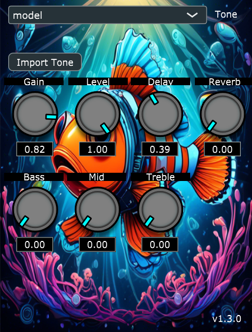

# NEMO

This is the NEMO repository, which is a plugin utilizing neural networks to emulate the sound of analog guitar pedals like distortions, fuzz, and overdrive.

## THE PROJECT'S OBJECTIVE

The primary aim is to develop a user-friendly plugin that enables users to accurately reproduce the sound and behavior of non-time-varying analog effect pedals, such as distortion or overdrive. This entails providing musicians and audio enthusiasts with a seamless digital alternative that faithfully emulates the unique characteristics and nuances of these classic analog devices. The objective is to ensure that users can easily integrate the plugin into their workflow, harnessing its capabilities to enhance their musical compositions or recordings while preserving the authentic tone and dynamics of traditional analog equipment.

## HOW RUN NEMO PLUGIN
You can follow this tutorial to run the application on your own machine.
### Step 0 - Copy the Repo
To run the various components of the application, you first need to download the github repo on your local machine.
### Step - Modify the CMAkeLists.txt
In the CMakeLists.txt, modify the path "add_subdirectory("C:/Users/Utente/OneDrive - Politecnico di Milano/Desktop/JUCE" ./JUCE)" with your local path associated with JUCE.
### Step 2 - Build with Cmake
Stay in the repository's home directory and create a build for Visual Studio using CMake
### Step 3 - Open the project in Visual Studio
Open the project in Visual Studio and build the project. `For safety, rebuild with CMake if Visual Studio cannot find files such as JuceHeader.h.`
### Step 4 - Now you can run the NEMO plugin
You can run the NEMO plugin as a standalone software or in a DAW as a VST.

## HOW RUN PYTHON SCRIPT FOR TRAINING
## TESTING FOLDER

## PROJECT INFO

## OTHER INFO
